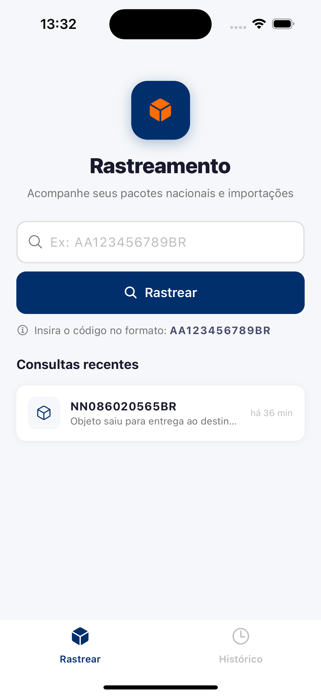
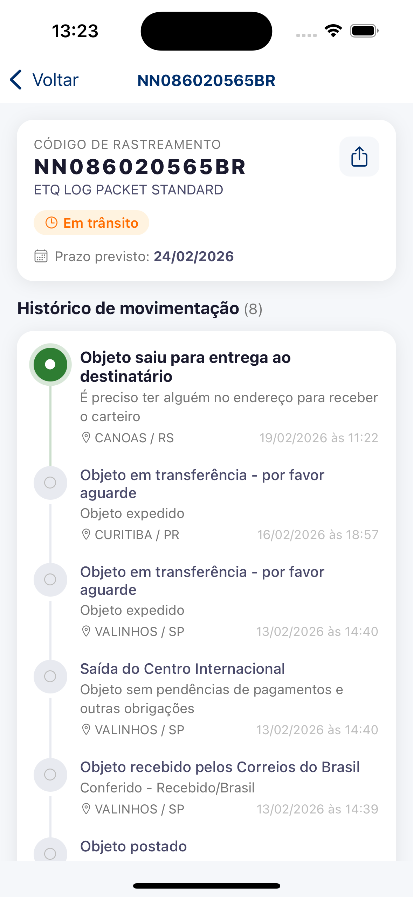

# 📦 Rastreamento Correios

Aplicativo mobile + API REST para rastrear encomendas dos Correios (nacionais e importações) sem necessidade de contrato ou cartão de postagem.

<div align="center">
  
  &nbsp;&nbsp;&nbsp;
  
</div>

---

## Funcionalidades

- 🔍 Busca por código de rastreamento (formato `AA123456789BR`)
- 📋 Linha do tempo completa de movimentações com indicador animado do status atual
- 🌐 Suporte a encomendas nacionais e importações
- 🕘 Histórico local de consultas recentes (AsyncStorage)
- 🗑️ Remoção individual ou total do histórico (swipe para deletar)
- 📤 Compartilhamento do status da encomenda
- 📅 Prazo previsto de entrega
- 🔄 Pull-to-refresh para atualizar rastreamento

---

## Arquitetura

```
api-correios/
├── api/          # Backend Node.js/Express
│   └── src/
│       ├── config/           # Variáveis de ambiente
│       ├── controllers/      # Handlers das rotas
│       ├── middlewares/      # Error handler
│       ├── routes/           # Definição de rotas
│       └── services/         # Integração com PacoteVício (RapidAPI)
│
└── mobile/       # App React Native (Expo 50)
    └── src/
        ├── components/       # EventCard, StatusBadge, TrackingInput
        ├── navigation/       # Stack + Bottom Tabs
        ├── screens/          # Home, Tracking, Histórico
        ├── services/         # Cliente HTTP para a API
        ├── theme/            # Paleta de cores
        ├── types/            # Interfaces TypeScript
        └── utils/            # Formatação de datas, AsyncStorage
```

---

## Stack

**API**
- Node.js + Express
- Axios
- [PacoteVício (RapidAPI)](https://rapidapi.com/pacotevicio-pacotevicio-default/api/correios-rastreamento-de-encomendas) — rastreamento Correios sem cartão de postagem
- Rate limiting, Helmet, CORS

**Mobile**
- React Native 0.73 + Expo SDK 50
- TypeScript
- React Navigation (Native Stack + Bottom Tabs)
- `@expo/vector-icons` (Ionicons)
- `@react-native-async-storage/async-storage`
- `react-native-gesture-handler` (swipe para deletar)

---

## Pré-requisitos

- Node.js 18+
- Expo Go instalado no celular **ou** simulador iOS/Android
- Conta gratuita no [RapidAPI](https://rapidapi.com) com acesso à API [PacoteVício](https://rapidapi.com/pacotevicio-pacotevicio-default/api/correios-rastreamento-de-encomendas)

---

## Configuração

### 1. Clone o repositório

```bash
git clone https://github.com/seu-usuario/api-correios.git
cd api-correios
```

### 2. Configure a API

```bash
cd api
npm install
cp .env.example .env
```

Edite o `.env` com sua chave do RapidAPI:

```env
PORT=3000
RAPIDAPI_KEY=sua_chave_aqui
NODE_ENV=development
```

> **Como obter a chave (gratuito):**
> 1. Crie uma conta em [rapidapi.com](https://rapidapi.com)
> 2. Acesse a [API PacoteVício](https://rapidapi.com/pacotevicio-pacotevicio-default/api/correios-rastreamento-de-encomendas)
> 3. Clique em **Subscribe to Test** → plano **Basic (gratuito)**: 1.000 req/mês
> 4. Copie o valor do campo `X-RapidAPI-Key` nos exemplos de código

### 3. Configure o Mobile

```bash
cd mobile
npm install
```

> Se for testar em **dispositivo físico**, edite `mobile/src/services/api.ts` e substitua `localhost` pelo IP da sua máquina na rede local:
> ```ts
> const BASE_URL = __DEV__
>   ? 'http://192.168.x.x:3000/api'
>   : 'https://sua-api.exemplo.com/api';
> ```

---

## Executando

### API

```bash
cd api
node server.js
# Servidor rodando em http://localhost:3000
```

### Mobile

```bash
cd mobile
npx expo start
```

Escaneie o QR Code com o Expo Go ou pressione `i` para abrir no simulador iOS / `a` para Android.

---

## Endpoints

### `GET /health`

```json
{ "status": "ok", "timestamp": "2026-02-19T12:00:00.000Z" }
```

### `GET /api/rastreamento/:codigo`

Rastreia um objeto pelo código.

```bash
curl http://localhost:3000/api/rastreamento/NN086020565BR
```

```json
{
  "codigo": "NN086020565BR",
  "tipo": "PACKET STANDARD IMPORTAÇÃO",
  "descricao": "ETQ LOG PACKET STANDARD",
  "ultimoStatus": "Objeto saiu para entrega ao destinatário",
  "entregue": false,
  "prazoEntrega": "2026-02-25",
  "isImportacao": false,
  "eventos": [
    {
      "data": "2026-02-19T11:22:32",
      "status": "Objeto saiu para entrega ao destinatário",
      "detalhe": "É preciso ter alguém no endereço para receber o carteiro",
      "local": "CANOAS / RS",
      "codigo": "OEC",
      "tipo": "01"
    }
  ]
}
```

### `POST /api/rastreamento/lote`

Rastreia múltiplos objetos (até 10) em paralelo.

```bash
curl -X POST http://localhost:3000/api/rastreamento/lote \
  -H "Content-Type: application/json" \
  -d '{ "codigos": ["NN086020565BR", "LY123456789CN"] }'
```

```json
{ "resultados": [ { ... }, { ... } ] }
```

---

## Variáveis de Ambiente

| Variável | Descrição | Padrão |
|---|---|---|
| `PORT` | Porta do servidor | `3000` |
| `RAPIDAPI_KEY` | Chave de acesso à API PacoteVício | — |
| `NODE_ENV` | Ambiente (`development` / `production`) | `development` |

---

## Formato dos Códigos

| Tipo | Exemplo | Padrão |
|---|---|---|
| Nacional | `AA123456789BR` | 2 letras + 9 dígitos + `BR` |
| Importação (China) | `LY123456789CN` | 2 letras + 9 dígitos + código do país |
| Importação (EUA) | `RA123456789US` | 2 letras + 9 dígitos + código do país |

---

## Licença

MIT
